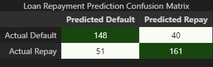
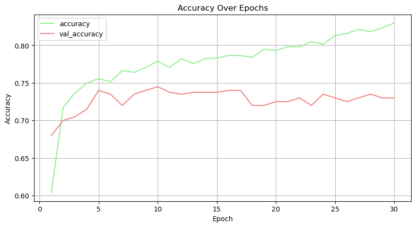
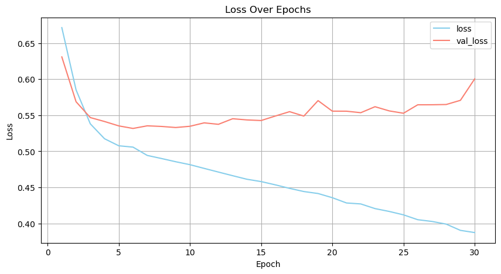

# neural-network-challenge-1

## Description
This project builds a recommendation system that assists students in finding tailored loan options based on their financial profiles. The process involved rigorous data preprocessing, feature selection, and dimensionality reduction through Principal Component Analysis (PCA). Finally, the model was tuned using Keras for optimal performance, resulting in a tool that could accurately recommend loan options.

## Table of Contents
1. [Usage](#usage)
2. [Model Development](#model-development)
3. [Results](#results)
4. [Credits](#credits)

## Usage
The recommendation system is designed for educational institutions or financial organizations aiming to provide student loan recommendations. 

> Key steps included:
- **Data Preprocessing**: Checking correlations, addressing multicollinearity with Variance Inflation Factor (VIF), and removing highly correlated variables.
- **Dimensionality Reduction**: Using PCA to reduce the dataset's complexity while retaining important patterns.
- **Feature Selection**: Reevaluating VIF, correlations, and p-values to finalize the most impactful features.
- **Model Tuning and Training**: Utilizing Keras for hyperparameter tuning to optimize the model for accuracy.

## Model Development
The model was tuned using Keras, and a grid search helped identify the optimal parameters. Key hyperparameters used in the final model were:
- **Number of Layers**: `5`
- **Activation Functions**: `[relu, sigmoid]`
- **Epochs**: `30`
- **Optimizer**: `adam`

Feature selection and PCA led to a streamlined dataset that improved model accuracy while avoiding overfitting.

## Results
The model was evaluated based on its classification performance, with metrics including accuracy, confusion matrix, and a detailed classification report. Below are the main results:

### Accuracy and Loss
- **Accuracy**: `0.77250`
- **Loss**: `0.51682`

### Confusion Matrix
The confusion matrix below shows the model's ability to predict each class accurately:

### Classification Report
The table below highlights precision, recall, F1-score, and support for each class in the test data:

| Class         | Precision | Recall | F1-Score | Support |
|---------------|-----------|--------|----------|---------|
| Class 0       | 0.74      | 0.79   | 0.76     | 188     |
| Class 1       | 0.80      | 0.76   | 0.78     | 212     |
| **Overall**   | **0.77**  | **0.77** | **0.77**  | **400** |

> **Note**: This table is generated using the `classification_report` from sklearn.

### Accuracy and Loss Graphs
Graphs tracking the accuracy and loss over epochs help visualize model performance:

> **Accuracy**

> **Loss**  

## Credits
Starter code for this assignment was provided by [edX bootcamp](https://www.edx.org/boot-camps).

The `utils` folder includes helpful code from a previous [project](https://github.com/Corey-Holton/Group_project_2) of mine that enabled:
- **Pretty-printed labeled boxes** for summary displays
- **VIF and p-value calculations** to handle multicollinearity effectively
- **Highlighted graphs and correlation tables** for data visualization

